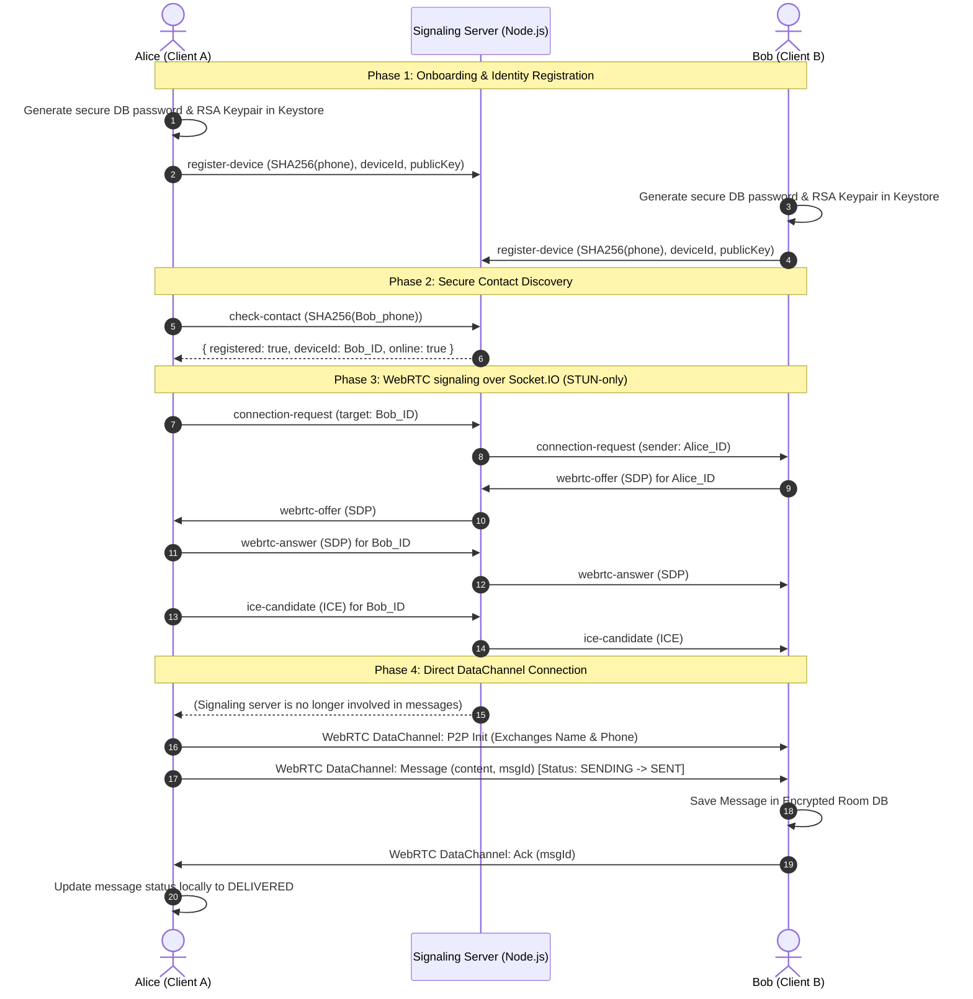

# PersonalChat: Private 1-to-1 P2P Messaging App

PersonalChat is a secure, private, 1-to-1 text messaging proof-of-concept. It combines a privacy-preserving signaling system with a direct WebRTC DataChannel transport layer, ensuring that no chat content, history, or raw identity data is ever sent to or processed by a central server.

---

## Workspace Layout
The repository contains two main sub-projects:

1. **`signaling-server/`**: A Node.js signaling and presence server using Express and Socket.IO. It operates fully in-memory to relay SDP negotiations and candidate discoveries.
2. **`android-client/`**: An Android project written in Java following MVVM patterns. It features SQLCipher-encrypted Room databases, Keystore key protections, and Google WebRTC.

---

## Core Privacy Architecture

The application implements a zero-trust model toward the signaling server. Chat payloads and raw phone numbers never touch the app server.



---

## Security Highlights

1. **Zero Database Servers**: No Mongo, Postgres, or server databases are used.
2. **SQLCipher Local Room**: Messages are persisted only inside Zetetic SQLCipher databases on each respective device.
3. **Android Keystore Protection**: Database encryption passphrases are generated via `SecureRandom` on first launch, encrypted with keys locked in the hardware-backed keystore, and stored securely.
4. **Direct Metadata Exchange**: Display names and phone numbers are exchanged directly peer-to-peer over the data channel only *after* WebRTC has connected. The server knows nothing about who belongs to what device ID other than hashed matching parameters.
5. **No Message Relays**: If a direct WebRTC connection cannot be built (e.g. strict firewall rules block STUN traversal), the app states "Unable to establish a direct private connection". It *never* falls back to sending message text over Socket.IO.

---

## How to Setup & Run

### 1. Run the Signaling Server
Navigate to `signaling-server/`:
```bash
cd signaling-server
npm install
npm start
```
By default, this spins up the server on port `3000`.

### 2. Build the Android Client
Open the `android-client/` directory in Android Studio:
- Let Android Studio index and synchronize dependencies automatically.
- To execute unit tests:
  ```bash
  ./gradlew test
  ```
- To run on your emulator or physical devices, hit the **Run** button inside Android Studio.
- Verify the signaling URL in settings:
  - If running in the standard emulator, keep `http://10.0.2.2:3000`.
  - If running on real devices, update the URL in settings to match your machine's local network IP (e.g. `http://192.168.1.50:3000`).

---

## Roadmap TODOs
- **Phone OTP Login**: Modular authentication gateway to prevent identity spoofing.
- **TURN Relay Support**: To handle restrictive firewall NAT network traversal.
- **End-to-End Encryption**: Signal Protocol double ratchet on top of WebRTC data streams.
- **FCM Push Notifications**: Waking up target receivers to initiate peer connections.
